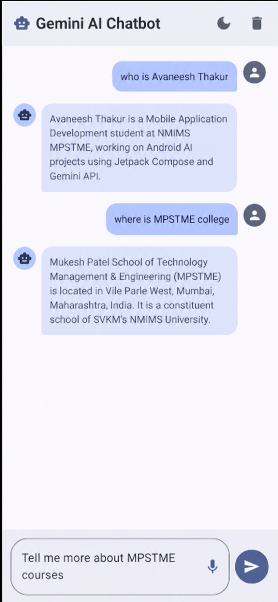

# Assignment 1 - C032
#!/usr/bin/env bash

set -euo pipefail

# ============================================
# GEMINI AI CHATBOT - GITHUB SETUP SCRIPT
# Author: Avaneesh Thakur
# Roll Number: C032
# ============================================

REPO_URL="${1:?Usage: ./setup.sh <github-repository-url> [project-folder]}"
PROJECT_FOLDER="${2:-GeminiAIChatbot}"

echo "=========================================="
echo "   GEMINI AI CHATBOT - GITHUB SETUP"
echo "=========================================="

echo
echo "Cloning GitHub repository..."

git clone "$REPO_URL" "$PROJECT_FOLDER"

cd "$PROJECT_FOLDER"

echo "Repository cloned successfully."

echo
echo "Creating README.md..."

cat > README.md <<'EOF'
# Gemini AI Chatbot

## Mobile Application Development Lab - Assignment 1

**Name:** Avaneesh Thakur  
**Roll Number:** C032  
**Program:** B.Tech Computer Science  
**University:** SVKM's NMIMS University, School of Technology Management & Engineering

---

## About the Project

Gemini AI Chatbot is a modern Android application that allows users to interact with Google's Gemini AI through an intuitive and responsive chat interface.

The application enables users to send text prompts, receive AI-generated responses, and interact with the chatbot using voice input.

It also includes local chat history storage, allowing users to access previous conversations after restarting the application.

This project demonstrates modern Android development concepts, including declarative UI design, AI integration, state management, local data persistence, voice recognition, responsive layouts, and secure API configuration.

---

## Key Features

### 1. AI-Powered Chat

- Integration with Google Gemini AI
- Text-based interaction with the chatbot
- Conversational display of user and AI messages
- Loading indicators and error handling

### 2. Modern User Interface

- Developed using Jetpack Compose
- Material 3 design components
- Separate chat bubbles for user and AI messages
- LazyColumn for displaying conversations
- Automatic scrolling to the latest message

### 3. Voice Input

- Voice-to-text functionality using RecognizerIntent
- Allows users to speak their prompts
- Voice interaction integrated into the chat interface

### 4. Persistent Chat History

- Local storage for chat conversations
- Conversations remain available after restarting the application
- Asynchronous database operations using Kotlin Coroutines

### 5. User Preferences

- Preferences DataStore for application settings
- Support for dark mode preferences
- Configurable automatic scrolling behavior

### 6. Theme Support

- Light and dark theme support
- System theme compatibility
- Consistent Material 3 styling

### 7. Responsive Layout

- Adaptable interface for different Android screen sizes
- Support for portrait and landscape orientations
- Flexible layouts for smartphones and larger displays

### 8. API Key Protection

- API key configuration through `local.properties`
- Secure handling of sensitive credentials
- Avoids logging or displaying API keys

For production deployment, a secure backend proxy is recommended to keep API credentials away from the client application.

---

## Technology Stack

| Technology | Purpose |
|---|---|
| Kotlin | Android application development |
| Jetpack Compose | Declarative user interface |
| Material 3 | UI components and theming |
| Google Gemini AI | AI-generated responses |
| Room Database | Local chat history storage |
| Preferences DataStore | User preferences |
| Android Keystore | Cryptographic key protection |
| StateFlow | Reactive state management |
| Kotlin Coroutines | Asynchronous operations |
| RecognizerIntent | Voice-to-text input |
| JUnit | Unit testing |
| Compose UI Testing | Interface testing |

---

## Application Architecture

The application follows an MVVM-inspired architecture that separates the user interface, application logic, and data management.

### Presentation Layer

The presentation layer is built using Jetpack Compose.

Responsibilities include:

- Displaying messages
- Accepting user input
- Handling voice interactions
- Showing loading and error states
- Managing themes and responsive layouts

### ViewModel Layer

The `ChatViewModel` manages the chatbot's UI state and coordinates communication between the interface and the data layer.

`StateFlow` is used to expose state changes to the Compose UI.

### Repository Layer

The repository provides a connection between the ViewModel and the data sources.

It manages:

- Communication with Gemini AI
- Chat history operations
- Data retrieval and storage

### Data Layer

The data layer manages the application's data sources, including:

- Gemini AI integration
- Room Database
- Preferences DataStore
- Secure API key management

---

## Application Workflow

```text
User Input
    |
    v
Jetpack Compose UI
    |
    v
ChatViewModel
    |
    v
Gemini Repository
    |
    +----> Local Chat Storage
    |
    v
Gemini AI Service
    |
    v
AI-Generated Response
    |
    v
ChatViewModel Updates State
    |
    v
Jetpack Compose UI


